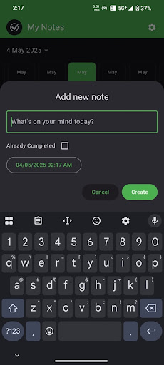
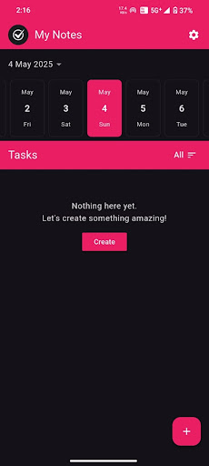
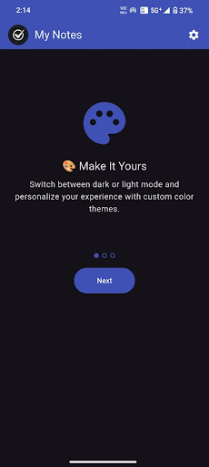
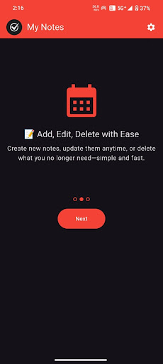
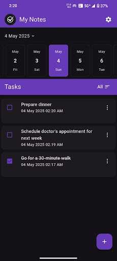
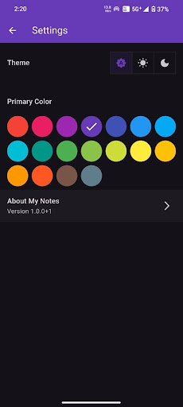

# My Notes

Simple offline note-taking app with themes, colors, and date-based organization.

### Social Links

1. [~~Google Play store~~]()
2. [Indus App store](https://www.indusappstore.com/apps/productivity/my-notes/io.github.ankitdotdev.my_notes?page=details&id=io.github.ankitdotdev.my_notes)

My Notes is a clean, offline note-taking app designed to help you stay organized without distractions. Whether you're jotting down quick thoughts or managing your daily tasks, My Notes gives you full control with a beautiful and minimal interface.

The app stores all your notes directly on your device. There’s no need to create an account or connect to the internet — your data stays private and secure. It’s perfect for users who prefer a simple, fast, and offline-first experience.

My Notes offers full theme customization, including light, dark, and system modes. You can also choose from a variety of color themes to personalize the look and feel of your notes.

Managing your tasks is easy. You can mark notes as completed or active and filter them to view all, only active, or completed items. The horizontal date picker allows you to quickly slide through dates and see notes created or assigned on a specific day.

While the app works entirely offline, we’ve included minimal ads using Google AdMob to support development. These ads may use internet access, but they do not affect your notes or collect any personal data from you.

If you're looking for a lightweight, distraction-free notes app that respects your privacy, My Notes is the perfect choice.

 
 
 
 
 

